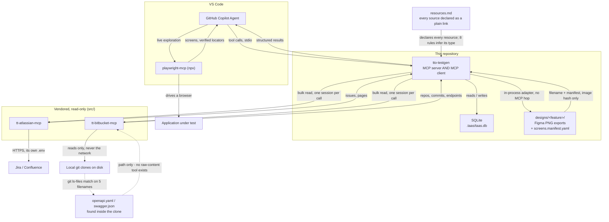
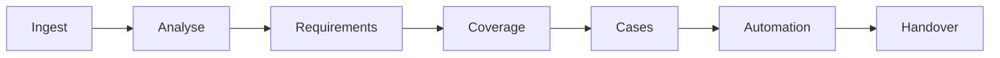

# TTO Test Analyst Agent System — `tto-testgen`

The deterministic toolchain behind TAAS, exposed to the GitHub Copilot agent as a
local MCP server.

**What this is.** TAAS is two halves. The *agent layer* is Copilot configuration —
instructions, chat modes, prompt files — where reasoning about requirements happens.
This repository is the other half: the code that owns every fact which must stay
true across thousands of test cases. Identifier allocation, de-duplication, coverage
arithmetic, traceability enforcement, resumable run state.

The split is the design. The model reasons about meaning; deterministic code
guarantees the rest. A rule the model is merely asked to follow erodes over 6,000
cases and many sessions; a rule the storage layer enforces does not.

---

## Architecture

> A fuller, presentation-ready version of this section — every diagram below at
> a larger scale, plus the source register, the trust boundary and the layering
> contracts — lives in [`architecture.html`](architecture.html) in the repository
> root. Open it in a browser; it prints and pastes into Confluence cleanly.

`tto-testgen` is both an MCP **server** (to Copilot) and an MCP **client** (to two
other servers, for bulk reads — fetching hundreds of Jira issues through the
model's own context would be slow and expensive). Every arrow below is a real,
separate stdio connection; nothing here shares a process or a socket.

Facts enter this system through four different doors, and the diagram is drawn to
make that visible: over the network with a credential, off local disk through a
vendored server, off local disk in-process, or from a live browser the agent
drives itself.



Four things worth reading off that diagram directly:

- **Nothing here holds a credential except `tt-atlassian-mcp`'s own `.env`**, which
  TAAS never touches. `tt-bitbucket-mcp` never contacts a network at all — it only
  reads git clones already on disk.
- **Every arrow into `tto-testgen` from Atlassian or Bitbucket is a fresh session,
  opened for one call and closed immediately** — not a connection held open for the
  life of the process. Only Playwright, which the agent drives directly for live
  exploration, sits outside `tto-testgen` entirely.
- **API contracts are discovered, not fetched.** `bitbucket_endpoints` scans the
  checked-out tree and reports both the routes it found in code and the path of any
  `swagger.json` / `openapi.json` / `swagger.yaml` / `openapi.yaml` / `openapi.yml`
  in it. Only the *path* comes back: `tt-bitbucket-mcp` exposes no tool that returns
  a file's raw content, so a spec's shapes are never auto-parsed. `api_model_derive`
  surfaces the paths as `spec_files_found` for you to open and compare against the
  code yourself.
- **Design information arrives as an exported folder, not a Figma API call.** A
  directory path in `resources.md` is the one classification rule that touches the
  filesystem, and `tto-testgen` reads it in-process — no MCP server sits in between.
  Each `feature__screen__state.png` is parsed from its filename, corrected
  field-by-field by an optional `screens.manifest.yaml`, and reduced to a content
  hash. The image bytes never leave the folder.

A single request walks this graph more than once. Asking Copilot to generate test
cases for a feature typically ingests through both vendored servers first (their
sessions open and close), builds the requirement and coverage model against SQLite,
and only then generates — each step a separate, auditable tool call, never one
opaque action.

Underneath the MCP layer, every request also moves through the same seven-stage
pipeline, one human gate at a time:



A stage cannot begin until the previous one is complete, approved, and unchanged
since approval — `unit_begin` is what enforces that, not convention. See
[**Sample prompts**](#sample-prompts) below for what to actually type at each stage,
or `presentation.html` in the repository root for a fully worked example tracing one
request through every one of these connections.

## Requirements

- Python 3.11 or later
- [`uv`](https://docs.astral.sh/uv/)
- VS Code with the GitHub Copilot Agent extension

Runs on macOS, Windows and Linux. No cloud service, no hosted component: all state
is a local SQLite file.

## Install

```bash
git clone <your-bitbucket-url>/tto-testgen.git
cd tto-testgen
uv sync
```

`uv sync` installs from the committed `uv.lock`, so every workstation resolves to an
identical dependency set.

## Configure

Nothing is required. Open this repo in VS Code and `tto-testgen` starts with zero
setup — `.vscode/mcp.json` runs it with no `.env` file needed at all. TAAS drives two
other MCP servers itself for bulk reads (fetching hundreds of Jira issues through the
model's context would be slow and expensive) — they're vendored inside this repo at
`src/tt-atlassian-mcp` and `src/tt-bitbucket-mcp`, and every default already points at
them.

`.env.example` documents every variable and its default; copy it only if you want to
override one:

```bash
cp .env.example .env   # optional - only to change a default
```

A copied `.env` is not read automatically by VS Code's launch of `tto-testgen` (it's
gitignored, and `uv run --env-file` fails if the file doesn't exist, so the default
command doesn't pass that flag) — either export the variables in your shell before
opening VS Code, or add `--env-file .env` to your own local copy of `.vscode/mcp.json`
once you've created one.

Neither takes a credential from TAAS:

| Server | How it authenticates |
|---|---|
| `tt-bitbucket-mcp` | It doesn't — it reads git clones already on disk and never contacts Bitbucket's network API at all |
| `tt-atlassian-mcp` | From its own `.env` next to its script, which TAAS never reads |

One-time setup for the Atlassian side only:

```bash
cd src/tt-atlassian-mcp
python3 -m pip install -r requirements.txt
cp .env.example .env   # fill in ATLASSIAN_BASE_URL, ATLASSIAN_EMAIL, ATLASSIAN_API_TOKEN
```

See `src/tt-atlassian-mcp/README.md` for the full setup, including corporate proxy
and TLS handling. `ATLASSIAN_READ_ONLY` defaults to `true`; leave it that way.

Everything else has a documented default. Two are business rules rather than
settings:

| Variable | Default | Effect |
|---|---|---|
| `TAAS_SIMILARITY_THRESHOLD` | `0.90` | What counts as a near-duplicate |
| `TAAS_COMMIT_LOOKBACK_DAYS` | `180` | How far back a Jira key may be derived from commits |

Changing either changes the corpus, so the effective values are recorded in run
metadata alongside the results they produced.

## Run

`.vscode/mcp.json` is committed and registers all four servers this project uses —
opening the folder in VS Code is the only setup step; nothing needs typing into a
settings file by hand:

```json
{
  "servers": {
    "tto-testgen": {
      "type": "stdio",
      "command": "uv",
      "args": ["run", "tto-testgen-mcp"]
    },
    "tto-atlassian": {
      "type": "stdio",
      "command": "python3",
      "args": ["${workspaceFolder}/src/tt-atlassian-mcp/atlassian_mcp_server.py"]
    },
    "tto-bitbucket": {
      "type": "stdio",
      "command": "python3",
      "args": ["${workspaceFolder}/src/tt-bitbucket-mcp/bitbucket_mcp_server.py"]
    },
    "playwright": {
      "type": "stdio",
      "command": "npx",
      "args": ["-y", "@playwright/mcp@latest"]
    }
  }
}
```

VS Code lists each of these under the Extensions view, **MCP Servers - Installed**.
Right-click a server there for **Start Server** / **Stop Server** / **Restart
Server** — the same manual control as any other MCP server registered globally in
VS Code's own `mcp.json` (`Show Configuration (JSON)` on that same menu opens
whichever file — workspace or global — actually defines it). Starting
`tto-testgen`, `tto-atlassian` and `tto-bitbucket` this way, individually, is the
normal way to run this project; nothing here needs all three left running at once.

To run `tto-testgen` outside VS Code entirely (a terminal, a CI step):

```bash
uv run tto-testgen-mcp
```

The server communicates over stdio and opens no network listener.

## Sample prompts

Copilot Chat works in one of seven modes (`.github/chatmodes/`), one per pipeline
stage, selected from the chat mode dropdown:

```
ingest -> analyse -> requirements -> coverage -> cases -> automation -> handover
```

Each mode names the tools visible in it, works on one feature at a time, and stops
after one stage — it will not choose the next one for you.

> **What "checkout" means below.** It is not a keyword, a built-in feature, or
> anything TAAS ships with — every prompt below is written against a placeholder
> feature called `checkout` (a generic e-commerce checkout flow) purely as a
> stand-in example. Nothing named `checkout` exists in your project until you
> ingest and analyse something and name it that yourself. **Replace it with the
> name of whatever feature you're actually working on** — if you're testing a
> login flow, say "Ingest the resources for login," not "...for checkout."

**Ingest** — resolve and pull in whatever `resources.md` declares
- "Ingest the resources for checkout."
- "What's declared in resources.md that hasn't been ingested yet?"
- "Show me every artefact we've pulled in for checkout so far."
- "List all the declared resources with their inferred type and ingestion status."
- "Which declared resources failed to ingest, and why?"
- "I added new links to resources.md — re-run ingestion and tell me what's new."
- "Show me just the Jira-issue artefacts we've ingested for checkout."
- "I dropped Figma screenshots into designs/checkout — ingest them."
- "Pull in the Confluence page that documents checkout's business rules."
- "I added a new Bitbucket repository to resources.md — ingest it and confirm it's reachable."
- "Has anything in Bitbucket or Jira changed since our last baseline? Run delta detection."
- "What's the delta baseline the next ingestion run would compare against?"

**Analyse** — build the application model from what's ingested
- "Build the application model for checkout from what we've ingested."
- "Derive the API model for the checkout-service repository."
- "Derive the API model for checkout-service and payments-service together."
- "Store the UI model for the screens we just explored with Playwright."
- "What features exist in the corpus so far?"
- "Show me everything we know about the checkout feature."
- "What business rules did you extract for checkout?"
- "List the user journeys identified for checkout."
- "Which ingested artefacts are still unassigned to any feature?"
- "What endpoints did the code scan find, and did we find an OpenAPI spec to check them against?"
- "What's the current state of the analyse unit for checkout — open, in progress, or blocked?"

**Requirements** — derive atomic, traceable requirements
- "Derive the testable requirements for checkout."
- "Show me the requirements captured for checkout, with their risk bands."
- "Where does this requirement trace back to — a direct Jira link, or derived from commit history?"
- "List every high-risk requirement for checkout."
- "Which requirements had no direct Jira link and had to be derived from commits?"
- "How many requirements do we have for checkout, broken down by category?"
- "Give me requirement TR-CHECKOUT-00003 in full, with its trace links."
- "Which requirements are still validation-only versus business-rule versus edge-case?"
- `/analyse-story` — extract features, rules and edge cases from one named Jira story

**Coverage** — plan and approve what gets generated, before anything is generated
- "Build the coverage baseline for checkout."
- "Give me the coverage forecast before we generate anything — planned counts by test type."
- "Approve the coverage baseline for checkout." (Test Lead only — everyone else is told so)
- "What gaps are open — requirements with no coverage, no derivable Jira key, manual-only cases, reduced-depth features?"
- "Reduce depth for checkout — it doesn't warrant full ISTQB coverage."
- "Show me the full traceability matrix for checkout."
- "Which coverage items are marked not-required, and what's the stated reason?"
- "How many planned cases per test type, before anything is generated?"
- "Who approved the last coverage baseline for checkout, and when?"
- "Show me every requirement with zero planned coverage."

**Cases** — generate the corpus against the approved baseline
- "Generate the test case batch for checkout."
- "Check for near-duplicates before I approve this batch."
- "How many cases do we have for checkout, by test type?"
- "Give me case TC-CHECKOUT-00012 in full — steps, expected results, test data, trace links."
- "Emit the human-readable views for the checkout batch."
- "Give me the volume report — total cases, automatable split, broken down by feature."
- "Query every manual-only case for checkout and tell me why each one couldn't be automated."
- "Which cases were rejected in the last batch, and what was the reason for each?"
- "Show me every case that traces back to requirement TR-CHECKOUT-00003."
- `/generate-cases` — generate the case batch for one named feature
- `/review-batch` — summarise a generated batch for operator review, short enough to read in a minute

**Automation** — emit Playwright TypeScript for the automatable cases
- "Emit Playwright specs for the automatable checkout cases."
- "Give me the automation report — automated versus manual, and why each manual one is manual."
- "Show me the generated spec for TC-CHECKOUT-00012."
- "Re-emit automation for checkout — the page structure changed since the last run."
- "Which automatable cases still don't have a spec generated?"
- `/generate-page-object` — produce one page object for a named screen, locators centralised, no fixed waits

**Handover** — assemble and verify the delivery package
- "Assemble the handover package for checkout."
- "Verify the handover project — does it actually build and pass structurally?"
- "Generate the coverage, gap, automation and delta reports."
- "Give me the full traceability matrix before we hand this off."
- "What's the delta baseline this handover package was built against?"
- "Give me the volume report for the whole handover package, not just checkout."
- "Run the gap report one more time before we hand off — what's still open?"
- `/coverage-report` — produce the coverage and gap report for one named feature, with every number's derivation shown

**Staying current, at any stage**
- "Has anything changed since the last completed run? Run delta detection and tell me what moved."
- "What's the baseline the next delta run would compare against?"
- "Which test cases now need a re-look because their source requirement or code changed?"
- "Were any cases retired automatically because the requirement behind them disappeared?"
- "Generate just the delta report — what's changed and what it affected."

**Diagnostics — not scoped to any one mode**
- "What's the status of the current run?"
- "Run a health check."
- "What state is the coverage unit in for checkout — open, approved, or blocked, and what opens it?"
- "Is any unit currently leased and idle long enough to look stuck?"
- `/resume-run` — report what's interrupted, what's complete and approved, and corpus totals; recommends nothing, since interrupted work is transactional and lost nothing

## Verify

```bash
uv run pytest                    # full suite
uv run pytest -m benchmark       # performance budgets at 10,000 cases
uv run lint-imports              # hexagonal boundary contracts
```

---

## What the toolchain enforces

These are refusals, not warnings. Each exists because the alternative is a corpus
nobody can trust.

| Rule | Enforced by |
|---|---|
| Every test case has at least one ordered step with an expected result | Domain construction, D7 validation, and a database trigger |
| Every test case resolves to a Jira key that was actually ingested | D3, D7, and a database trigger |
| Identifiers are allocated by the toolchain, never supplied | D5, plus an immutability trigger |
| Near-duplicates are refused | D4, using indexed bucket selection |
| Test data names the equivalence class it represents | Domain construction and a `NOT NULL` constraint |
| Nothing is hard-deleted | No `DELETE` against a business entity exists in any query module |
| Only the Test Lead approves a coverage baseline | `stage_approve` |
| A completed unit is not re-run without an explicit instruction | `unit_begin` |

The two most important rules are enforced twice, in the domain and in the schema.
The validator produces an error the agent can act on; the constraint makes the rule
unbreakable even if a future code path bypasses the validator. Neither alone is
enough: a constraint gives an unhelpful error, and a validator can be forgotten.

---

## Rollback

```bash
git checkout <previous-tag>
uv sync
```

Every release is a git tag. If a schema migration ran since that tag, revert it
first — every forward migration ships a tested reverse, so this is safe:

```bash
uv run python -c "
from tto_testgen.composition import build
from tto_testgen.adapters.sqlite.schema import migrate_down
app = build().value
print(migrate_down(app.connection, target=<version>))
"
```

A backup is taken automatically before any migration.

## Recovery

Backups live in `.taas/backups/` (the newest 10 are retained). Portable exports live
in `generated/exports/`.

Two mechanisms, because they cover different failures. A backup restores
byte-identically but is only readable by a compatible schema version. An export is
JSON Lines per table and survives a database the current code can no longer open.

See [`docs/restore-procedure.md`](docs/restore-procedure.md) for the full procedure
and the rehearsal scenario.

---

## Layout

```
src/tto_testgen/
  domain/        pure logic - no I/O, no dependencies outside stdlib
  ports/         protocol definitions only
  platform/      result types, logging, config, resilience, health
  adapters/      SQLite schema, migrations, repositories, backup
  mcp/           stdio server and the two-tier tool surface
  composition.py the only module that knows both a protocol and its implementation
src/tt-atlassian-mcp/  vendored - the MCP server TAAS drives for Jira and Confluence
src/tt-bitbucket-mcp/  vendored - the MCP server TAAS drives for repository reads
tests/
  unit/          example-based
  properties/    Hypothesis, targets domain/ only
  integration/   adapters against a real SQLite file
  benchmark/     performance budgets, run on demand
  fakes/         in-memory ports, shared by every unit
```

Dependencies point inward. `lint-imports` fails the build if a domain module imports
an adapter — that boundary is what keeps the property suite runnable without a
database, and it erodes silently without a contract to hold it.

## Not in scope

Test execution and Jenkins orchestration. This system generates tests and packages
them; the pipeline runs them. It never pushes to a repository and never writes
Jenkins configuration.
