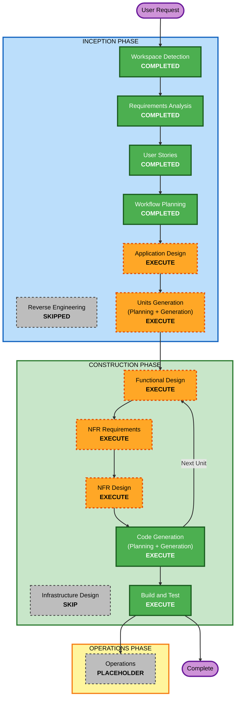

# Execution Plan

**Project**: TTO Test Analyst Agent System (TAAS)
**Stage**: INCEPTION - Workflow Planning
**Version**: 1.0
**Date**: 2026-08-28

---

## 1. Context Loaded

| Artefact | Status |
|---|---|
| `requirements.md` v1.0 | Loaded — 88 FRs, 47 NFRs, 12 constraints, 4 open decisions |
| `requirement-verification-questions.md` | Loaded — 23 answers |
| `requirements-clarification-questions.md` | Loaded — 3 answers |
| `stories.md` v1.0 | Loaded — 55 stories, 13 epics, 253 acceptance criteria |
| `personas.md` v1.0 | Loaded — 3 personas |
| Reverse engineering artefacts | None — greenfield project, stage skipped |

---

## 2. Detailed Analysis Summary

### 2.1 Transformation Scope

**Not applicable.** Greenfield project. There is no existing system to transform, no packages to
coordinate, no deployment model to migrate, and no component dependency graph to preserve.

### 2.2 Change Impact Assessment

| Impact area | Present | Description |
|---|---|---|
| **User-facing changes** | Yes | Three roles operate the system daily through VS Code. Seven approval gates. The system defines a new working practice for the test team, not merely a tool they invoke. |
| **Structural changes** | Yes | Entire architecture is new: a Copilot agent layer, a Python MCP server, a SQLite store, and four MCP integrations. |
| **Data model changes** | Yes | 18 entities (16 rows in §10.2, two of which name a pair) with integrity rules enforced as database constraints. The schema is where the traceability and mandatory-steps rules live, which makes it load-bearing rather than incidental. |
| **API changes** | Yes | The `tto-testgen-mcp` tool surface is a new contract the agent depends on. Its shape determines what the agent can and cannot do. |
| **NFR impact** | Yes | 47 non-functional requirements. Security enabled as blocking, resiliency enabled, property-based testing partial. Scale to 10,000 records with stated latency budgets. |

### 2.3 Application Layer Impact

- **Code**: Python 3.11+ toolchain (ingestion, storage, coverage, generation, traceability,
  emission, reporting), a TypeScript Playwright emitter target, and VS Code / Copilot configuration
- **Dependencies**: MCP Python SDK, SQLite via `sqlite3`, Pydantic, Hypothesis; on the generated
  side, `@playwright/test` — all pinned with lockfiles per NFR-SEC-09
- **Configuration**: `.vscode/mcp.json`, `.github/copilot-instructions.md`, path-scoped instruction
  files, per-stage chat modes, prompt files, `.env` for credentials
- **Testing**: example-based plus property-based tests over serialisation round-trips and the
  coverage and identifier invariants

### 2.4 Infrastructure Layer Impact

**Minimal, and deliberately so.** NFR-POR-02 requires that the system depend on no cloud service
and no hosted component. All state is local: a SQLite file and generated directories on the
operator's workstation. There is no deployment model, no networking, no scaling surface, and no
persistent infrastructure to provision.

The one genuine question in this area is how the Python toolchain reaches each operator's machine
and how a bad version is rolled back. That is recorded as **OD-02** and is answered at the NFR
Requirements stage.

### 2.5 Operations Layer Impact

- **Monitoring**: local structured logging with correlation identifiers, per-unit metrics, and a
  health check (NFR-OBS-01 to NFR-OBS-03). No hosted observability platform.
- **Alerting**: not applicable — there is no running service to alert on. Failures surface to the
  operator in-session.
- **Deployment**: not applicable to the agent system. The *generated* suite is pushed manually by
  the test team, and Jenkins orchestration is explicitly out of scope (C-07, FR-HND-04).

### 2.6 Risk Assessment

| Dimension | Assessment |
|---|---|
| **Risk Level** | **Medium** |
| **Rollback Complexity** | **Easy** |
| **Testing Complexity** | **Complex** |

**Why Medium rather than High.** The scope is system-wide and carries real unknowns — Copilot
request throughput across a multi-day run, selector stability against a live application, and
whether Jira key discipline in the repositories is good enough for FR-TRC-02 to be useful. But
nothing in production is at risk. If the system underperforms, the test team does not get its
suite; no existing service degrades, no data is lost, and no customer is affected.

**Why not Low.** Requirements risk R-08 is real: a coverage baseline approved on insufficient
review, multiplied across thousands of cases, is expensive to unwind. The FR-COV-06 Test Lead gate
and the FR-COV-04 yield forecast exist precisely to contain it, but the exposure is what keeps this
above Low.

**Why rollback is easy.** Greenfield, version-controlled, and the system writes only to the local
workspace. Both external systems are read-only, so no run can leave a trace anywhere but on disk.

**Why testing is complex.** Four external integrations with different failure characteristics, a
resumability guarantee that must hold under process termination, invariants that only manifest at
volume, and a system whose output is itself tests.

---

## 3. Workflow Visualization



### Text Alternative

```
INCEPTION PHASE
  Workspace Detection ......... COMPLETED
  Reverse Engineering ......... SKIPPED   (greenfield, no existing code)
  Requirements Analysis ....... COMPLETED
  User Stories ................ COMPLETED
  Workflow Planning ........... COMPLETED
  Application Design .......... EXECUTE
  Units Generation ............ EXECUTE

CONSTRUCTION PHASE  (per-unit loop for each unit of work)
  Functional Design ........... EXECUTE
  NFR Requirements ............ EXECUTE
  NFR Design .................. EXECUTE
  Infrastructure Design ....... SKIP      (no infrastructure services to map)
  Code Generation ............. EXECUTE   (always)
  Build and Test .............. EXECUTE   (always, after all units)

OPERATIONS PHASE
  Operations .................. PLACEHOLDER
```

---

## 4. Phases to Execute

### INCEPTION PHASE

- [x] **Workspace Detection** — COMPLETED
- [x] **Reverse Engineering** — SKIPPED
  - **Rationale**: Greenfield workspace. No source files, no build files, no repository. There is
    nothing to reverse engineer.
- [x] **Requirements Analysis** — COMPLETED
  - 88 functional and 47 non-functional requirements, approved 2026-08-28
- [x] **User Stories** — COMPLETED
  - 55 stories, 13 epics, 3 personas, approved 2026-08-28
- [x] **Workflow Planning** — IN PROGRESS (this document)
- [ ] **Application Design** — **EXECUTE**
  - **Rationale**: Every trigger applies. The system is entirely new components with no existing
    boundaries to work within. The toolchain's module structure is mandated by NFR-MNT-01, and its
    seven modules need their responsibilities and interfaces defined before anyone writes code.
    Critically, the `tto-testgen-mcp` tool surface is a contract the agent layer depends on: its
    shape determines what the agent can and cannot do, and getting it wrong is expensive to correct
    once instructions and chat modes are written against it. Component methods carrying business
    rules — de-duplication, coverage arithmetic, identifier allocation, traceability resolution —
    need specification before implementation.
- [ ] **Units Generation** — **EXECUTE**
  - **Rationale**: Multiple triggers apply. There are new data models (18 entities), a new API
    surface (the MCP tool set), complex algorithms (similarity comparison, coverage derivation,
    commit-to-key resolution), and state management (per-unit run state with resumability). 55
    stories cannot be built as one undifferentiated block. Decomposition is also what makes
    parallel work possible, and the story sequencing constraints already identified show a clear
    critical path worth planning around.

### CONSTRUCTION PHASE

Executed once per unit of work.

- [ ] **Functional Design** — **EXECUTE** (per unit)
  - **Rationale**: New data models and genuinely complex business logic. The coverage derivation
    rules, the similarity threshold and its normalisation, the commit-to-Jira-key resolution
    strategy, and the automatability classifier are all decisions that need to be made explicitly
    rather than emerging from whatever the implementation happens to do. The database integrity
    rules in §10.3 of `requirements.md` are business rules expressed as constraints and need
    designing as such.
- [ ] **NFR Requirements** — **EXECUTE** (per unit)
  - **Rationale**: 47 non-functional requirements with the Security Baseline enabled as blocking
    and the Resiliency Baseline enabled. This is also where **OD-01 to OD-04** are answered —
    backup interval and recovery point, toolchain distribution and rollback, recovery rehearsal,
    and whether file-level database encryption is required. Those decisions were deliberately
    deferred here rather than assumed, and this stage is where they must be put to you.
- [ ] **NFR Design** — **EXECUTE** (per unit)
  - **Rationale**: The non-functional requirements demand specific patterns rather than general
    care: bounded retry with backoff and failure isolation (NFR-REL-03, NFR-REL-04), transactional
    unit-state commit (NFR-REL-01, NFR-BAT-05), indexed similarity comparison to hold the
    performance budget at 10,000 records (NFR-PRF-01, NFR-PRF-03), and structured logging with
    correlation (NFR-OBS-01). Each is a design decision with alternatives worth weighing.
- [ ] **Infrastructure Design** — **SKIP**
  - **Rationale**: This stage maps a system onto actual infrastructure services. This system has
    none. NFR-POR-02 requires no cloud service and no hosted component; all state is a local SQLite
    file and local directories. There is no deployment topology, no networking, no storage service,
    and no scaling configuration to design.
  - **What is not lost by skipping it**: the one real question in this territory — how the toolchain
    is distributed to operator workstations and how a bad version is rolled back — is **OD-02**, and
    it is answered at NFR Requirements. Skipping this stage does not skip that decision.
  - **When to reverse this**: if you later decide the toolchain should run somewhere shared — a
    build agent, a container, a hosted MCP endpoint — this stage becomes necessary. Say so and it
    is added back.
- [ ] **Code Generation** — **EXECUTE** (always, per unit)
  - **Rationale**: Implementation planning and code generation are required for every unit.
- [ ] **Build and Test** — **EXECUTE** (always, after all units)
  - **Rationale**: Build instructions, unit tests, integration tests across the four MCP
    boundaries, and the property-based suite required by the partial PBT mode.

### OPERATIONS PHASE

- [ ] **Operations** — **PLACEHOLDER**
  - **Rationale**: Stage is a placeholder in AI-DLC. No deployment or monitoring workflows are
    defined. For this system the omission costs little, since there is nothing deployed to operate.

---

## 5. Unit Decomposition Outlook

Units are decided at the Units Generation stage. Based on the epic structure and the sequencing
constraints already recorded in `stories.md`, the shape is likely to be **6 to 9 units**, with a
critical path through the platform foundation.

| Likely unit | Epics | Depends on |
|---|---|---|
| Core Platform | E13 (schema, MCP server, observability, security) | — |
| Ingestion | E1 | Core Platform |
| Analysis | E2, E3 | Core Platform, Ingestion |
| Coverage | E4 | Analysis |
| Test Case Generation | E5, E8 | Coverage, Core Platform |
| Automation and Handover | E6, E7 | Test Case Generation |
| Orchestration | E9, E12 | Core Platform |
| Reporting | E11 | Test Case Generation |
| Re-baselining | E10 | Ingestion, Test Case Generation |

**Critical path**: Core Platform to Ingestion to Analysis to Coverage to Test Case Generation to
Automation and Handover. Orchestration can proceed in parallel once Core Platform exists, which is
the main argument for building Core Platform first and building it well.

This table is an outlook, not a decision. Units Generation will produce the actual decomposition
with its own dependency analysis.

---

## 6. Estimated Effort

Stated in AI-DLC stage executions and approval gates rather than calendar time, because throughput
depends on your team's availability and on Copilot request limits that have not been measured.

| Phase | Stage executions | Approval gates |
|---|---|---|
| INCEPTION remaining | 2 (Application Design, Units Generation) | 2 |
| CONSTRUCTION per unit | 4 (Functional Design, NFR Requirements, NFR Design, Code Generation) | 4 |
| CONSTRUCTION for 6-9 units | 24-36 | 24-36 |
| Build and Test | 1 | 1 |
| **Total remaining** | **27-39** | **27-39** |

**Assumption A-01 from `requirements.md` bears directly on this**: the estimate assumes Copilot
request volume is sufficient for sustained multi-stage work. If it is not, the batch and gate model
still functions — the stages simply take longer in wall-clock time. Nothing in the design breaks;
the pace changes.

---

## 7. Success Criteria

**Primary goal**: a working TTO Test Analyst Agent System that takes a `resources.md`, a screenshot
folder and Bitbucket repositories, and produces a traceable test corpus plus a standard Playwright
project the test team can push and run.

### Key deliverables

| Deliverable | Source |
|---|---|
| `tto-testgen-mcp` Python MCP server with typed tools | US-ENB-02 |
| Versioned SQLite schema enforcing traceability and mandatory steps as constraints | US-ENB-01 |
| Copilot agent layer: instructions, path-scoped instructions, per-stage chat modes, prompt files, MCP registration | E12 |
| Ingestion adapters for Jira, Confluence, Bitbucket, Figma screenshots | E1 |
| Application model: features, journeys, rules, API surface, UI screens with verified locators | E2 |
| Coverage baseline model with yield forecasting and gap analysis | E4 |
| Test case corpus with mandatory steps and enforced Jira traceability | E5, E8 |
| Playwright TypeScript emitter producing a standard project | E6, E7 |
| Coverage, gap, automation and traceability reports | E11, US-TRC-04 |
| Delta re-baselining pipeline | E10 |
| Example-based and property-based test suite | US-ENB-06 |

### Quality gates

1. All 10 acceptance criteria in §14 of `requirements.md` satisfied
2. Zero test cases in the corpus without a Jira key link or without ordered steps — enforced by
   database constraint, verified by query
3. Generated Playwright project installs from its lockfile, compiles, and lists its tests on a
   clean machine with no modification
4. A run interrupted mid-batch resumes with no lost or duplicated work
5. No credential present anywhere in the repository or the database
6. Property-based tests pass for serialisation round-trips and the documented invariants
7. Security Baseline compliance recorded at every stage with no unresolved blocking finding
8. Resiliency Baseline compliance recorded, with OD-01 to OD-04 answered at NFR Requirements

---

## 8. Stages Not Executing

| Stage | Status | Reason | Reversible |
|---|---|---|---|
| Reverse Engineering | SKIPPED | Greenfield — nothing exists to analyse | Not meaningfully; there is no codebase |
| Infrastructure Design | SKIP | No infrastructure services to map; all state is local by requirement (NFR-POR-02) | Yes — say so and it is added back |
| Operations | PLACEHOLDER | Not implemented in AI-DLC | Not applicable |
