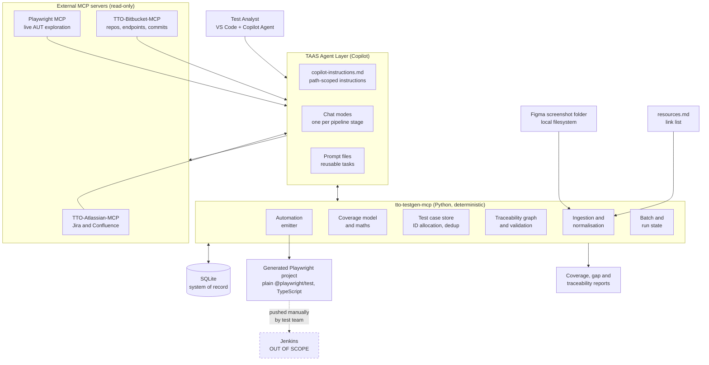

# Requirements: TTO Test Analyst Agent System

**Project**: TTO Test Analyst Agent System (TAAS)
**Phase**: INCEPTION
**Stage**: Requirements Analysis
**Depth**: Comprehensive
**Version**: 1.0
**Date**: 2026-08-28

---

## 1. Intent Analysis Summary

| Attribute | Assessment |
|---|---|
| **User request** | Build an agent system that consumes requirements, documentation, UI designs, source code and APIs to determine what needs testing, produce the test scenarios, and generate the automation — handing the automated suite to an existing Jenkins pipeline for execution. |
| **Request type** | New Project (greenfield) |
| **Request clarity** | Clear — reinforced by 23 requirement answers and 3 clarification answers |
| **Scope estimate** | System-wide, multi-integration (4 MCP servers, 4 external systems) |
| **Complexity estimate** | Complex — high artefact volume, strict traceability, multi-stage pipeline, constrained execution environment |
| **Requirements depth** | Comprehensive |

The defining constraint is stated in the request and shapes every decision below: **there are no direct
LLM API keys.** The system therefore cannot be a service that calls a model. It must be a VS Code
GitHub Copilot workspace in which the model reasons, paired with deterministic local tooling that
does everything reasoning is bad at — counting, storing, de-duplicating, allocating identifiers,
enforcing invariants, and surviving interruption.

---

## 2. Problem Statement

The test team is starting from zero. There is no test-case suite, no automation framework, and no
coverage baseline. The information needed to build one is real but scattered: Jira stories,
Confluence pages, several Bitbucket repositories, and a folder of Figma screenshots.

Doing this by hand has three failure modes the team already knows:

1. **Coverage is asserted rather than derived.** Nobody can show which requirement produced which
   test, so nobody can prove what is untested.
2. **Consistency decays with volume.** The thousandth test case is written to a different standard
   than the first.
3. **The baseline goes stale immediately.** By the time analysis finishes, the application has moved.

The system must industrialise the path from artefact to automated test, and make coverage a
computed fact rather than a claim.

---

## 3. Goals and Success Criteria

| # | Goal | Success criterion |
|---|---|---|
| G1 | Establish an initial test coverage baseline from available artefacts | A coverage model exists that names every testable feature, the test types required for each, and the rationale — reviewed and approved by a human before any test case is written |
| G2 | Generate a comprehensive, traceable test-case corpus | Every test case carries mandatory ordered steps, expected results, test data where applicable, and at least one Jira key link. Zero untraceable cases in the corpus. |
| G3 | Convert suitable cases into maintainable automation | A standard `@playwright/test` TypeScript project the test team can push to their own Bitbucket repository and wire into Jenkins without modification |
| G4 | Survive scale | The pipeline runs to completion across a corpus in the thousands without losing, duplicating, or corrupting work, and resumes cleanly after any interruption |
| G5 | Stay current | After the baseline exists, a delta run identifies what changed in Jira and Bitbucket and updates only the affected cases and tests |
| G6 | Keep humans in control | Every pipeline stage stops at a human gate; batch scope is named by the operator, never assumed by the agent |

---

## 4. Scope

### 4.1 In Scope

- The Copilot agent layer: repository instructions, path-scoped instructions, chat modes, prompt files, MCP registration
- The deterministic toolchain (`tto-testgen-mcp`), including its SQLite store
- Ingestion and normalisation of Jira, Confluence, Bitbucket, Figma screenshots, and OpenAPI specs
- Application understanding: features, user journeys, business rules, API surface, UI screens and states
- Testable requirement identification and the coverage baseline model
- Test-case generation with mandatory steps and traceability
- Playwright TypeScript automation generation for UI and API
- Assembly of the handover project directory
- Coverage, gap, and traceability reporting
- Incremental re-baselining

### 4.2 Out of Scope

- **Test execution.** The system never runs the generated suite as a deliverable activity.
- **Jenkins configuration and orchestration.** The test team creates and configures Jenkins jobs manually.
- **Pushing to any repository.** TTO-Bitbucket-MCP is read-only; the team pushes the generated project themselves.
- **Writing to Jira or Confluence.** Atlassian access is read-only in this release.
- **Docker images or packaged archives.** Superseded by the clarification answer: the output is a plain Playwright project.
- **Modifying the application under test.**
- **Test data provisioning in live environments.** The system specifies test data; it does not seed it.

---

## 5. Actors and External Systems

### 5.1 Actors

| Actor | Description | Interaction |
|---|---|---|
| **Test Analyst (Operator)** | Primary user. A member of the test team working in VS Code. | Names the batch scope, reviews artefacts, approves each stage gate |
| **Test Automation Engineer** | Consumes and maintains the generated Playwright project | Reviews generated code, pushes to Bitbucket, wires Jenkins |
| **Test Lead** | Accountable for coverage adequacy | Reviews and approves the coverage baseline and gap reports |

### 5.2 External Systems

| System | Access | Role |
|---|---|---|
| **GitHub Copilot (VS Code)** | Corporate subscription; Claude Sonnet 5 among supported models | The reasoning engine. No API key; all model access is via Copilot. |
| **TTO-Atlassian-MCP** | Read-only in this release | Jira issues and Confluence pages |
| **TTO-Bitbucket-MCP** | Read-only (no write tools exist) | Repository content, endpoints, commit history and Jira key coverage |
| **Microsoft Playwright MCP** | Live browser control | UI exploration against the running application, selector derivation |
| **Application Under Test** | Deployed test/QA environment, reachable from the operator's machine | The live system Playwright MCP explores |
| **Figma screenshot folder** | Local filesystem, predefined path | UI design input |
| **Jenkins** | Out of scope | Consumes the pushed project; not integrated with by this system |

---

## 6. Hard Constraints

| ID | Constraint | Source |
|---|---|---|
| C-01 | No direct LLM API keys. All model access is through GitHub Copilot in VS Code. | Stated requirement |
| C-02 | Models limited to the corporate Copilot roster, including Claude Sonnet 5. | Stated requirement |
| C-03 | Development and operation occur in VS Code with the GitHub Copilot Agent plugin. | Stated requirement |
| C-04 | SQLite is the database technology where one is required. | Stated requirement |
| C-05 | Atlassian access is read-only. | Q4 = A |
| C-06 | Bitbucket access is read-only; the system never pushes to a repository. | CQ1 answer |
| C-07 | Test execution and Jenkins orchestration are outside the system boundary. | Stated requirement |
| C-08 | The handover artefact is a plain, standard Playwright project — not a Docker image, not an archive. | CQ2 answer |
| C-09 | Generated UI and API automation is TypeScript on `@playwright/test`. | Q5 = A, Q6 = A |
| C-10 | The deterministic toolchain is Python 3.11+, exposed to Copilot as a local MCP server. | Q7 = A, Q8 = A |
| C-11 | Every test case must carry at least one Jira key link. | Q11 answer |
| C-12 | Batch scope is named by the operator; the agent does not select the next unit of work. | CQ3 = B |

---

## 7. System Context



### Text Alternative

```
Test Analyst works in VS Code with the Copilot Agent.

The TAAS Agent Layer (instructions, chat modes, prompt files) directs Copilot's reasoning.

The agent calls two categories of MCP server:
  - tto-testgen-mcp    - local, deterministic, Python. Owns the SQLite database.
  - External read-only - TTO-Atlassian-MCP, TTO-Bitbucket-MCP, Playwright MCP.

Local file inputs:
  - resources.md            - plain list of Jira, Confluence and Bitbucket links
  - Figma screenshot folder - predefined path, filename convention plus optional manifest

SQLite is the system of record for every artefact, coverage decision, test case and link.

Outputs written to the local workspace:
  - A plain @playwright/test TypeScript project
  - Coverage, gap and traceability reports

The test team pushes the generated project to their own Bitbucket repository and configures
Jenkins jobs manually. Jenkins is outside the system boundary.
```

---

## 8. Pipeline Definition

Seven stages, each ending at a human gate.

```
+---------------+   +---------------+   +---------------+   +---------------+
| 1. Input      |-->| 2. Analyse    |-->| 3. Testable   |-->| 4. Coverage   |
|    Sources    |   |    and        |   |    Require-   |   |    Baseline   |
|               |   |    Understand |   |    ments      |   |               |
+---------------+   +---------------+   +---------------+   +---------------+
                                                                    |
        +-----------------------------------------------------------+
        |
        v
+---------------+   +---------------+   +---------------+
| 5. Generate   |-->| 6. Generate   |-->| 7. Handover   |
|    Test Cases |   |    Automation |   |    Package    |
|               |   |               |   |               |
+---------------+   +---------------+   +---------------+
```

| Stage | Purpose | Primary output | Gate |
|---|---|---|---|
| 1. Input Sources | Resolve and ingest every declared artefact | Normalised artefact records in SQLite | Operator confirms the ingested inventory |
| 2. Analyse and Understand | Build the application model | Features, journeys, business rules, API surface, screens | Operator reviews the application model |
| 3. Identify Testable Requirements | Derive atomic, testable statements | Testable requirement records with source links | Operator reviews the requirement set |
| 4. Establish Coverage Baseline | Decide what must be tested and to what depth | Coverage model, gap report | **Test Lead approves the baseline** |
| 5. Generate Test Cases | Produce the corpus | Structured test cases + generated Markdown/YAML views | Operator reviews per batch |
| 6. Generate Automation | Emit Playwright TypeScript | Page objects, specs, fixtures, API clients | Automation engineer reviews per batch |
| 7. Handover Package | Assemble the project | A complete, standalone Playwright project directory | Operator verifies, then pushes manually |

---

## 9. Functional Requirements

### 9.1 Agent Layer

| ID | Requirement | Priority |
|---|---|---|
| FR-AGT-01 | The system SHALL provide a `.github/copilot-instructions.md` establishing project-wide standards: role, pipeline model, traceability rules, output conventions, and the prohibition on inventing untraceable content. | Must |
| FR-AGT-02 | The system SHALL provide path-scoped `.github/instructions/*.instructions.md` files with `applyTo` globs, so that editing generated Playwright code loads the automation coding standards and editing test-case views loads the test-case standards. | Must |
| FR-AGT-03 | The system SHALL provide one chat mode per pipeline stage, each declaring the tool set that stage is permitted to use, so an ingestion session cannot accidentally emit automation. | Must |
| FR-AGT-04 | The system SHALL provide reusable prompt files for recurring tasks (analyse one story, generate cases for one feature, generate a page object, produce a coverage report). | Must |
| FR-AGT-05 | The system SHALL provide `.vscode/mcp.json` registering `tto-testgen-mcp`, TTO-Atlassian-MCP, TTO-Bitbucket-MCP, and Playwright MCP. | Must |
| FR-AGT-06 | Agent instructions SHALL require that all durable state changes go through `tto-testgen-mcp` tools rather than direct file writes, so that the SQLite store remains the single source of truth. | Must |

### 9.2 Input Ingestion

| ID | Requirement | Priority |
|---|---|---|
| FR-ING-01 | The system SHALL read a `resources.md` file containing a plain list of links, and infer each resource's type from its URL or path pattern (Jira issue, Jira project or JQL, Confluence page or space, Bitbucket repository, OpenAPI spec, local folder). | Must |
| FR-ING-02 | The system SHALL report any link whose type cannot be inferred, rather than guessing or silently skipping it. | Must |
| FR-ING-03 | The system SHALL ingest Jira issues via `jira_get_issue` and `jira_search_issues`, capturing key, type, summary, description, acceptance criteria, status, labels, parent/epic, and comments. | Must |
| FR-ING-04 | The system SHALL ingest Confluence pages via `confluence_get_page` and `confluence_search`, preserving tables as structured data. | Must |
| FR-ING-05 | The system SHALL enumerate Bitbucket repositories via `bitbucket_repos` and record branch, head commit, project key, and slug for every ingested repository. | Must |
| FR-ING-06 | The system SHALL extract the HTTP API surface via `bitbucket_endpoints`, recording method, route, file, line, defining symbol, and any discovered OpenAPI specification. | Must |
| FR-ING-07 | The system SHALL ingest Figma screenshots from the predefined folder, parsing the `<feature>__<screen>__<state>` filename convention and merging an optional `screens.manifest.yaml` sidecar where present. | Must |
| FR-ING-08 | The system SHALL record, for every ingested artefact, a content hash, the source identifier, and the ingestion timestamp, to support change detection. | Must |
| FR-ING-09 | The system SHALL record ingestion provenance for every artefact so that any downstream test case can name the exact source it came from. | Must |
| FR-ING-10 | Ingestion SHALL be idempotent: re-ingesting an unchanged artefact SHALL NOT create duplicate records. | Must |

### 9.3 Analyse and Understand

| ID | Requirement | Priority |
|---|---|---|
| FR-ANA-01 | The system SHALL derive a feature model — a hierarchy of features and sub-features — from the ingested artefacts, with each feature linked to its supporting sources. | Must |
| FR-ANA-02 | The system SHALL identify user journeys spanning multiple screens or endpoints. | Must |
| FR-ANA-03 | The system SHALL extract explicit business rules (validation rules, state transitions, calculations, permissions) as discrete records. | Must |
| FR-ANA-04 | The system SHALL build an API model from `bitbucket_endpoints` and any OpenAPI spec, recording request and response shapes, status codes, and authentication requirements where discoverable. | Must |
| FR-ANA-05 | The system SHALL build a UI model of screens, components, and states, combining Figma screenshots, front-end source, and live exploration. | Must |
| FR-ANA-06 | The system SHALL use Playwright MCP against the live application to derive real, stable selectors, preferring role- and label-based locators and recording a fallback chain per element. | Must |
| FR-ANA-07 | The system SHALL identify integration points and external dependencies. | Must |
| FR-ANA-08 | Where the live application contradicts a Figma screenshot or a Jira description, the system SHALL record the discrepancy rather than silently preferring one source. | Must |

### 9.4 Identify Testable Requirements

| ID | Requirement | Priority |
|---|---|---|
| FR-TRQ-01 | The system SHALL decompose features, rules, endpoints, and screens into atomic testable requirements, each independently verifiable. | Must |
| FR-TRQ-02 | Each testable requirement SHALL be classified as functional or non-functional, and assigned a category (UI behaviour, API contract, business rule, validation, integration, security, performance, accessibility). | Must |
| FR-TRQ-03 | Each testable requirement SHALL carry a risk rating derived from documented factors (business criticality, complexity, integration surface, change frequency from commit history). | Must |
| FR-TRQ-04 | Each testable requirement SHALL link to at least one source artefact and resolve to at least one Jira key per FR-TRC-01. | Must |
| FR-TRQ-05 | The system SHALL identify edge cases, boundary conditions, and failure scenarios for each requirement, including error paths present in code but absent from documentation. | Must |

### 9.5 Establish Coverage Baseline

| ID | Requirement | Priority |
|---|---|---|
| FR-COV-01 | The system SHALL produce a coverage model that, for every testable requirement, states which test types are required and why. | Must |
| FR-COV-02 | The coverage model SHALL span at minimum: functional positive, functional negative, boundary, validation, UI behaviour, API contract, integration, permissions/authorisation, and error handling. | Must |
| FR-COV-03 | Coverage depth SHALL be derived from documented rules — equivalence partitioning, boundary value analysis, decision tables, and state transitions — not from an arbitrary target count. | Must |
| FR-COV-04 | The system SHALL compute and report the expected test-case yield per feature before generation, so the operator sees the shape of the corpus in advance. | Must |
| FR-COV-05 | The system SHALL produce a gap report listing every testable requirement with no planned coverage, and every discovered behaviour that could not be traced to a Jira key. | Must |
| FR-COV-06 | The coverage baseline SHALL require explicit human approval before any test case is generated. | Must |
| FR-COV-07 | The system SHALL support a documented risk-based reduction: the operator may mark features as reduced-depth, and the model SHALL record the decision and its effect on yield. | Should |

### 9.6 Generate Test Cases

| ID | Requirement | Priority |
|---|---|---|
| FR-TCG-01 | Each test case SHALL contain: a stable identifier, title, feature, test type, priority, preconditions, **ordered test steps**, expected result per step, overall expected result, test data where applicable, automatability classification, tags, and traceability links. | Must |
| FR-TCG-02 | **Test steps are mandatory.** A test case without ordered, executable steps SHALL be rejected by the toolchain. | Must |
| FR-TCG-03 | Test data SHALL be specified wherever the test depends on specific input values, including the equivalence class or boundary the value represents. | Must |
| FR-TCG-04 | Test case identifiers SHALL be allocated by the toolchain, never by the model, and SHALL be stable across regeneration. | Must |
| FR-TCG-05 | The system SHALL detect and reject near-duplicate test cases using deterministic similarity comparison over normalised steps and expected results. | Must |
| FR-TCG-06 | The system SHALL classify each case as automatable or manual-only, recording the reason. | Must |
| FR-TCG-07 | The corpus size SHALL be an outcome of the coverage model, not a quota. The system SHALL NOT pad the corpus to reach a target figure, and SHALL report the computed total with its derivation. | Must |
| FR-TCG-08 | The system SHALL generate Markdown and YAML views sharded per feature from the SQLite store, suitable for human review and version control. | Must |
| FR-TCG-09 | Generated test data SHALL be synthetic. The system SHALL NOT copy production data or personal data from source artefacts into test cases. | Must |
| FR-TCG-10 | Test cases SHALL be tagged for suite (smoke, regression, full), type (ui, api), feature, and priority. | Must |

### 9.7 Generate Automation

| ID | Requirement | Priority |
|---|---|---|
| FR-AUT-01 | The system SHALL generate a standard `@playwright/test` project in TypeScript, following conventional Playwright project structure with no bespoke runner or wrapper framework. | Must |
| FR-AUT-02 | UI automation SHALL follow the Page Object Model, with one page object per screen and locators defined centrally. | Must |
| FR-AUT-03 | Locators SHALL prefer `getByRole`, `getByLabel`, and `getByTestId` over CSS or XPath, using selectors verified against the live application via Playwright MCP. | Must |
| FR-AUT-04 | API automation SHALL use Playwright's `APIRequestContext` within the same project, sharing fixtures and authentication with the UI tests. | Must |
| FR-AUT-05 | Generated tests SHALL carry tag annotations matching their test case tags, so Jenkins can select suites by tag expression. | Must |
| FR-AUT-06 | Every generated test SHALL reference its source test case identifier and Jira key in an annotation, preserving traceability into the execution report. | Must |
| FR-AUT-07 | The project SHALL externalise environment configuration (base URL, credentials, timeouts) to environment variables with a documented `.env.example`, and SHALL contain no hardcoded credentials. | Must |
| FR-AUT-08 | The project SHALL configure both the HTML reporter and the JUnit XML reporter, so Jenkins can consume results without modification. | Must |
| FR-AUT-09 | Generated code SHALL avoid fixed waits, using Playwright's auto-waiting and explicit expectation-based waits instead. | Must |
| FR-AUT-10 | The system SHALL only generate automation for cases classified automatable; manual-only cases SHALL be excluded and reported. | Must |
| FR-AUT-11 | Generated automation SHALL be regenerable: re-running generation for a feature SHALL produce a deterministic result and SHALL NOT silently discard hand-edits, which SHALL be detected and reported. | Must |

### 9.8 Handover Package

| ID | Requirement | Priority |
|---|---|---|
| FR-HND-01 | The system SHALL assemble a complete, standalone Playwright project directory in the local workspace: `package.json`, `package-lock.json`, `playwright.config.ts`, `tsconfig.json`, tests, page objects, fixtures, API clients, test data, `.env.example`, `.gitignore`, and `README.md`. | Must |
| FR-HND-02 | Dependencies SHALL be pinned to exact versions and a lockfile SHALL be committed. | Must |
| FR-HND-03 | The `README.md` SHALL document installation, environment configuration, tag-based suite selection, and the reporter outputs Jenkins consumes. | Must |
| FR-HND-04 | The system SHALL NOT push to any repository and SHALL NOT create or modify Jenkins configuration. The operator performs the push and the Jenkins job setup manually. | Must |
| FR-HND-05 | The system SHALL verify the assembled project's structural integrity before declaring handover ready — that every referenced page object, fixture, and data file exists and that TypeScript compiles. | Must |
| FR-HND-06 | The system SHALL emit a handover manifest listing every generated test, its test case identifier, its Jira key, and its tags. | Must |

### 9.9 Traceability

| ID | Requirement | Priority |
|---|---|---|
| FR-TRC-01 | Every test case SHALL carry at least one link to a Jira key. A test case without one SHALL be rejected by the toolchain. | Must |
| FR-TRC-02 | Where a behaviour is discovered in source code or a Figma screenshot with no directly associated Jira story, the system SHALL derive a Jira key from commit history using `bitbucket_log` and `bitbucket_changes`, and SHALL record the link with type `derived-from-commit`. | Must |
| FR-TRC-03 | Link types SHALL be recorded distinctly — `direct-story`, `derived-from-commit`, `confluence`, `code-symbol`, `screenshot` — so reviewers can judge the strength of each link. A `derived-from-commit` link SHALL NOT be presented as equivalent to a direct story link. | Must |
| FR-TRC-04 | Where no Jira key can be derived by any means, the behaviour SHALL be recorded in the gap report and SHALL NOT become a test case. | Must |
| FR-TRC-05 | The system SHALL produce a bidirectional traceability matrix: requirement to test case to automated test, and the reverse. | Must |
| FR-TRC-06 | The system SHALL report Jira key coverage percentage for ingested repositories, using the coverage figures the Bitbucket MCP provides. | Should |

### 9.10 Batch and Run State

| ID | Requirement | Priority |
|---|---|---|
| FR-BAT-01 | The operator SHALL name the scope of each batch — the feature or feature set, and the pipeline stage. The agent SHALL NOT select the next unit of work on its own initiative. | Must |
| FR-BAT-02 | The system SHALL maintain durable per-unit, per-stage run state in SQLite: not started, in progress, completed, failed, needs review. | Must |
| FR-BAT-03 | The system SHALL provide read-only status reporting on operator request, showing what has been completed and what remains. This is reporting, not proposing. | Must |
| FR-BAT-04 | Any batch SHALL be resumable after interruption — a crashed session, a closed editor, an exhausted context window — without losing completed work or duplicating it. | Must |
| FR-BAT-05 | Work SHALL be committed to SQLite transactionally at unit granularity, so an interrupted unit leaves no partial state. | Must |
| FR-BAT-06 | The system SHALL detect and refuse a batch that would re-generate an already-completed unit, unless the operator explicitly requests regeneration. | Must |
| FR-BAT-07 | Every pipeline stage SHALL stop at a human gate; the system SHALL NOT advance a unit to the next stage without recorded approval. | Must |

### 9.11 Incremental Re-baselining

| ID | Requirement | Priority |
|---|---|---|
| FR-DLT-01 | The system SHALL detect changes since the last run using `bitbucket_changes` and `bitbucket_diff` between the recorded head commit and the current head. | Must |
| FR-DLT-02 | The system SHALL detect Jira changes since the last run using JQL over the updated timestamp. | Must |
| FR-DLT-03 | The system SHALL map detected changes to affected features, testable requirements, test cases, and automated tests through the traceability graph. | Must |
| FR-DLT-04 | The system SHALL classify each affected test case as unchanged, requires-update, or obsolete, with the reason recorded. | Must |
| FR-DLT-05 | The system SHALL never silently delete a test case. Obsolete cases SHALL be marked and retained with the reason and the change that obsoleted them. | Must |
| FR-DLT-06 | Delta runs SHALL be subject to the same human gates as the initial baseline. | Must |
| FR-DLT-07 | The system SHALL maintain a run history so that any test case can be traced to the run that created or last modified it. | Should |

### 9.12 Reporting

| ID | Requirement | Priority |
|---|---|---|
| FR-RPT-01 | The system SHALL produce a coverage report: per feature, per test type, planned versus generated, with the derivation shown. | Must |
| FR-RPT-02 | The system SHALL produce a gap report: uncovered requirements, untraceable behaviours, manual-only cases, and features with reduced-depth coverage. | Must |
| FR-RPT-03 | The system SHALL produce a traceability matrix in both Markdown and CSV. | Must |
| FR-RPT-04 | The system SHALL produce an automation report: cases automated, cases deferred, and the reason for each deferral. | Must |
| FR-RPT-05 | Reports SHALL be generated from SQLite, never hand-assembled by the model. | Must |

---

## 10. Data Requirements

### 10.1 System of Record

SQLite is authoritative. Markdown and YAML files are generated views and are safe to delete and
regenerate. This inverts the usual arrangement deliberately: coverage arithmetic over thousands of
records is a database problem, and review is a file problem.

### 10.2 Core Entities

| Entity | Purpose |
|---|---|
| `resource` | A declared input from `resources.md` or the screenshot folder |
| `artefact` | An ingested item — Jira issue, Confluence page, source file, endpoint, screenshot — with content hash and provenance |
| `feature` | A node in the feature hierarchy |
| `journey` | A multi-step user flow |
| `business_rule` | A discrete extracted rule |
| `api_endpoint` | Method, route, file, line, symbol, spec reference |
| `screen` / `ui_element` | UI model, including verified locator chains |
| `testable_requirement` | Atomic verifiable statement with category and risk |
| `coverage_item` | A required (requirement, test type) pairing with depth and rationale |
| `test_case` | The case itself |
| `test_step` | Ordered steps belonging to a case — mandatory, never empty |
| `test_data` | Data bound to a case or step, with its equivalence class |
| `trace_link` | Typed edge between any two entities, carrying link type |
| `automated_test` | A generated spec file and test, linked to its case |
| `run` / `unit_state` | Batch and stage progress |
| `change_event` | A detected delta and its impact classification |

### 10.3 Data Integrity Rules

- A `test_case` with zero `test_step` rows is invalid (FR-TCG-02)
- A `test_case` with no `trace_link` resolving to a Jira key is invalid (FR-TRC-01)
- `test_case` identifiers are allocated by the toolchain and are immutable
- Deletion is soft; obsolete records retain their reason and originating change event

---

## 11. Non-Functional Requirements

### 11.1 Scale and Volume

| ID | Requirement |
|---|---|
| NFR-SCL-01 | The system SHALL operate against 3-10 Bitbucket repositories, 100-500 Jira stories, and 30-150 screens. |
| NFR-SCL-02 | The system SHALL handle a corpus in the thousands of test cases without degradation. Approximately 6,000 is the expected order of magnitude for a full application; the actual figure follows from the inputs, and a single small story may legitimately yield around ten cases. |
| NFR-SCL-03 | Storage, indexing, and report generation SHALL remain responsive at 10,000 test cases, providing headroom above the expected volume. |
| NFR-SCL-04 | No operation SHALL require the entire corpus to be held in a model context window. Work SHALL be sliced to feature granularity. |

### 11.2 Performance

| ID | Requirement |
|---|---|
| NFR-PRF-01 | Toolchain operations on a single test case SHALL complete in under 200 ms at 10,000 records. |
| NFR-PRF-02 | Full report generation over 10,000 test cases SHALL complete in under 30 seconds. |
| NFR-PRF-03 | Duplicate detection SHALL use indexed comparison rather than pairwise scanning. |
| NFR-PRF-04 | The system SHALL cache ingested artefacts by content hash to avoid redundant MCP calls to Jira, Confluence, and Bitbucket. |

### 11.3 Reliability and Resumability

| ID | Requirement |
|---|---|
| NFR-REL-01 | All state changes SHALL be transactional; an interrupted operation SHALL leave the database consistent. |
| NFR-REL-02 | The system SHALL survive external MCP failure — Jira unavailable, Bitbucket timeout, browser crash — by recording the failure against the unit and leaving completed work intact. |
| NFR-REL-03 | The system SHALL apply bounded retry with backoff to transient external failures, and SHALL fail the unit rather than the run when retries are exhausted. **(RESILIENCY-10)** |
| NFR-REL-04 | The system SHALL not cascade a single unit's failure into a run-wide failure. **(RESILIENCY-10)** |
| NFR-REL-05 | The SQLite database SHALL be backed up before every destructive or schema-changing operation, with backups retained locally. **(RESILIENCY-12)** |
| NFR-REL-06 | The system SHALL support export of the complete corpus to a portable format, so the corpus survives loss of the database file. **(RESILIENCY-12)** |
| NFR-REL-07 | Schema migrations SHALL be versioned and reversible. |

### 11.4 Security

| ID | Requirement |
|---|---|
| NFR-SEC-01 | No credentials, tokens, or API keys SHALL appear in source code, generated code, configuration files, or the database. All secrets SHALL come from environment variables or the operating system credential store. **(SECURITY-12)** |
| NFR-SEC-02 | The `tto-testgen-mcp` server SHALL communicate over stdio and SHALL NOT open a network listener. **(SECURITY-07, SECURITY-08)** |
| NFR-SEC-03 | All MCP tool inputs SHALL be validated against typed schemas — type, length bounds, format — before use. **(SECURITY-05)** |
| NFR-SEC-04 | All database access SHALL use parameterised queries. String-concatenated SQL is prohibited. **(SECURITY-05)** |
| NFR-SEC-05 | All deserialisation of YAML, JSON, and Markdown front-matter from repositories SHALL use safe loaders that cannot instantiate arbitrary types. **(SECURITY-13)** |
| NFR-SEC-06 | The toolchain SHALL emit structured logs with timestamp, correlation ID, level, and message. Logs SHALL NOT contain credentials, tokens, or personal data. **(SECURITY-03)** |
| NFR-SEC-07 | Every external call — MCP, filesystem, database — SHALL have explicit error handling, and the system SHALL fail closed. A global handler SHALL catch unhandled exceptions, log them, and return a safe result. **(SECURITY-15)** |
| NFR-SEC-08 | Error messages returned to the agent SHALL be actionable but SHALL NOT expose filesystem paths outside the workspace, connection strings, or internal stack detail. **(SECURITY-09)** |
| NFR-SEC-09 | Dependencies SHALL be pinned with lockfiles for both the Python toolchain and the generated Playwright project; a vulnerability scanning step SHALL be documented; an SBOM SHALL be generated. **(SECURITY-10)** |
| NFR-SEC-10 | Proprietary content ingested from Jira, Confluence, and Bitbucket SHALL be treated as confidential. Generated artefacts intended for a separate repository SHALL carry only what a test needs — behaviour and expectations — not verbatim internal documentation. **(SECURITY-11)** |
| NFR-SEC-11 | Generated test data SHALL be synthetic. Personal data encountered in source artefacts SHALL NOT be propagated into test cases or automation. **(SECURITY-11)** |
| NFR-SEC-12 | The SQLite database and generated artefacts SHALL be excluded from version control by default via `.gitignore`, preventing accidental publication of ingested corporate content. **(SECURITY-01, SECURITY-11)** |
| NFR-SEC-13 | Modification of test cases and coverage decisions SHALL be recorded with actor, timestamp, and the change made. **(SECURITY-13, SECURITY-14)** |
| NFR-SEC-14 | The system SHALL respect the read-only posture of Atlassian and Bitbucket access; no code path SHALL invoke a write tool against either. **(SECURITY-06, least privilege)** |
| NFR-SEC-15 | Data at rest: the SQLite database and generated artefacts reside only on the operator's workstation. Protection at rest SHALL rely on the organisation's mandatory full-disk encryption. Where full-disk encryption is not enforced on operator machines, the database SHALL be encrypted at the file level (SQLCipher). **Open decision — to be confirmed at the NFR Requirements stage.** **(SECURITY-01)** |
| NFR-SEC-16 | Data in transit: `tto-testgen-mcp` communicates over stdio with no network transport. All external traffic to Jira, Confluence, Bitbucket, and the AUT SHALL use TLS 1.2 or above, enforced by the respective MCP servers and the browser. No unencrypted protocol SHALL be used. **(SECURITY-01)** |

### 11.5 Observability

| ID | Requirement |
|---|---|
| NFR-OBS-01 | The system SHALL log every MCP tool invocation with correlation to the run and unit. **(RESILIENCY-05)** |
| NFR-OBS-02 | The system SHALL expose a health check verifying database accessibility, schema version, and external MCP reachability. **(RESILIENCY-06)** |
| NFR-OBS-03 | The system SHALL record per-unit metrics — duration, artefacts consumed, cases produced, failures — for pipeline diagnosis. **(RESILIENCY-05, RESILIENCY-07)** |

### 11.6 Maintainability and Testability

| ID | Requirement |
|---|---|
| NFR-MNT-01 | The toolchain SHALL separate concerns into distinct modules: ingestion, analysis storage, coverage, generation, traceability, emission, reporting. |
| NFR-MNT-02 | The toolchain SHALL have unit tests, with example-based tests covering documented behaviour. |
| NFR-MNT-03 | Property-based tests SHALL be provided using Hypothesis for pure functions and serialisation round-trips. **(PBT partial mode: PBT-02, PBT-03, PBT-07, PBT-08, PBT-09)** |
| NFR-MNT-04 | Round-trip properties SHALL be tested for test case serialisation (record to YAML to record), identifier encoding, and coverage model serialisation. **(PBT-02)** |
| NFR-MNT-05 | Invariant properties SHALL be tested for identifier uniqueness and monotonic allocation, traceability graph acyclicity where required, coverage totals equalling the sum of their parts, and de-duplication being reflexive and symmetric. **(PBT-03)** |
| NFR-MNT-06 | Property test generators SHALL be domain-specific — realistic Jira keys, realistic step structures — not unconstrained primitives. **(PBT-07)** |
| NFR-MNT-07 | Property tests SHALL support shrinking and deterministic reproduction via recorded seeds. **(PBT-08)** |
| NFR-MNT-08 | Generated automation SHALL follow a documented, consistent structure so a human can maintain it without reading the generator. |

### 11.7 Usability

| ID | Requirement |
|---|---|
| NFR-USA-01 | The operator SHALL be able to run any pipeline stage for a named feature with a single instruction, without recalling tool names or parameters. |
| NFR-USA-02 | Every generated artefact SHALL be human-readable and reviewable in the editor without special tooling. |
| NFR-USA-03 | The system SHALL state plainly what it could not determine, rather than filling gaps with plausible invention. |

### 11.8 Portability

| ID | Requirement |
|---|---|
| NFR-POR-01 | The toolchain SHALL run on macOS, Windows, and Linux with Python 3.11+. |
| NFR-POR-02 | The system SHALL depend on no cloud service and no hosted component. All state is local. |

---

## 11.9 Open Decisions Deferred to NFR Requirements

The Resiliency Baseline extension reserves certain decisions to the user rather than the model.
Most concern production cloud topology and do not apply to a workstation-local developer tool.
The following genuinely apply to this system and are scheduled — not decided — here.

| ID | Decision | Rule | Why it applies |
|---|---|---|---|
| OD-01 | Recovery point objective for the test-case corpus: how much generation work may be lost, and therefore how often the SQLite database is backed up and exported | RESILIENCY-02, RESILIENCY-11 | The corpus represents substantial accumulated effort; NFR-REL-05 and NFR-REL-06 set the baseline mechanism, but the interval is a business call |
| OD-02 | How the Python toolchain is distributed and updated across test-team workstations, and how a bad version is rolled back | RESILIENCY-04 | The team runs this on their own machines; the organisation may already have an internal package index or a standard clone-and-install convention |
| OD-03 | Whether recovery from database loss is rehearsed, and how often | RESILIENCY-13, RESILIENCY-14 | A backup nobody has restored is a hypothesis |
| OD-04 | Whether the file-level encryption fallback in NFR-SEC-15 is required, i.e. whether full-disk encryption is mandatory on operator machines | SECURITY-01 | Determines whether SQLCipher enters the dependency set |

Rules concerning multi-zone and multi-region topology, auto-scaling, and production incident
response are marked N/A: this system has no deployed production workload.

---

## 12. Assumptions

| ID | Assumption | If wrong |
|---|---|---|
| A-01 | The operator's Copilot subscription grants sufficient request volume for a multi-day generation run. | Throughput drops; the batch model still works but takes longer |
| A-02 | The AUT test environment is stable enough for Playwright MCP exploration during analysis. | Selector derivation falls back to source and screenshot inference |
| A-03 | Jira stories carry enough acceptance-criteria detail to derive testable requirements. | Yield per story falls; the gap report grows |
| A-04 | Commit messages carry Jira keys often enough for FR-TRC-02 to be useful. | More behaviours land in the gap report instead of the corpus |
| A-05 | The test team has write access to a Bitbucket repository for the generated suite. | Handover blocks on repository provisioning |
| A-06 | The predefined screenshot folder is populated and reasonably named. | Figma input contributes little; UI model relies on live exploration |
| A-07 | Jenkins agents can run Node and Playwright browsers. | The team must resolve this; it is outside the system boundary |

---

## 13. Risks

| ID | Risk | Impact | Mitigation |
|---|---|---|---|
| R-01 | Model invents test cases not grounded in any artefact | Corpus is polluted; coverage claims become false | FR-TRC-01 rejection at the toolchain layer — the model cannot persist an untraceable case |
| R-02 | Operator-named batching at 100-500 stories becomes tedious | Generation stalls part-way | FR-BAT-03 status reporting; per-unit resumability so partial progress always holds |
| R-03 | Duplicate and near-duplicate cases inflate the corpus | Maintenance burden, false coverage confidence | FR-TCG-05 deterministic de-duplication |
| R-04 | Generated selectors break on first UI change | Automation is abandoned | FR-AUT-03 role and label locators verified live; fallback chains recorded |
| R-05 | Corporate content leaks into the pushed test repository | Confidentiality breach | NFR-SEC-10, NFR-SEC-11, NFR-SEC-12 |
| R-06 | The corpus goes stale before it is finished | Wasted effort | FR-DLT-01 to FR-DLT-07 delta pipeline |
| R-07 | SQLite file lost or corrupted | Weeks of generation lost | NFR-REL-05 backups, NFR-REL-06 portable export |
| R-08 | Coverage baseline approved on insufficient review, multiplied across thousands of cases | Expensive rework | FR-COV-06 explicit Test Lead gate; FR-COV-04 yield forecast before generation |

---

## 14. Acceptance Criteria

The system is accepted when all of the following hold:

1. A test analyst can point the system at a `resources.md`, a screenshot folder, and Bitbucket repositories, and complete all seven pipeline stages for at least one feature.
2. Every test case in the corpus has at least one Jira key link and at least one ordered test step. Zero exceptions.
3. The coverage report derives its totals from the coverage model and shows the derivation.
4. The gap report names every requirement without coverage and every behaviour without a derivable Jira key.
5. The generated Playwright project installs from its lockfile, compiles, and runs `--list` successfully without modification.
6. Suites can be selected by tag, and both HTML and JUnit XML reports are configured.
7. A run interrupted mid-batch resumes with no lost or duplicated work.
8. A delta run after a Bitbucket and Jira change identifies exactly the affected cases and classifies each.
9. No credential appears anywhere in the repository or the database.
10. The property-based test suite passes for serialisation round-trips and the documented invariants.

---

## 15. Requirement Sources

| Answer | Decision | Requirements |
|---|---|---|
| Q1 A | Agent system only | Scope 4.1 |
| Q2 A | Live AUT available | FR-ANA-06, A-02 |
| Q3 A | Incremental re-baselining in scope | FR-DLT-01 to FR-DLT-07 |
| Q4 A | Atlassian read-only | C-05, NFR-SEC-14 |
| Q5 A | TypeScript + `@playwright/test` | C-09, FR-AUT-01 |
| Q6 A | API tests in the same project | FR-AUT-04 |
| Q7 A | Python 3.11+ toolchain | C-10, NFR-POR-01 |
| Q8 A | Local MCP server | C-10, FR-AGT-05 |
| Q9 A | SQLite system of record | 10.1, FR-TCG-08 |
| Q10 A+ | Structured cases, steps mandatory | FR-TCG-01, FR-TCG-02, FR-TCG-03 |
| Q11 custom | Jira key mandatory | C-11, FR-TRC-01 |
| Q12 A | Automatability classifier | FR-TCG-06, FR-AUT-10 |
| Q13 A / Q20 note | Volume is an outcome | FR-TCG-07, NFR-SCL-02 |
| Q14 B | Plain link list | FR-ING-01, FR-ING-02 |
| Q15 A | Filename convention + manifest | FR-ING-07 |
| Q16 B | Medium scale | NFR-SCL-01 |
| Q17 C / CQ2 X | Plain Playwright project, manual push | C-08, FR-HND-01, FR-HND-04 |
| Q18 A | Tag-driven selection | FR-TCG-10, FR-AUT-05 |
| Q19 B / CQ3 B | Operator-named batches | C-12, FR-BAT-01, FR-BAT-03 |
| Q20 A | Gate at every stage | FR-BAT-07, FR-COV-06 |
| Q21 A | Security baseline enabled | NFR-SEC-01 to NFR-SEC-14 |
| Q22 A | Resiliency baseline enabled | NFR-REL-01 to NFR-REL-07, NFR-OBS-01 to NFR-OBS-03 |
| Q23 B | PBT partial | NFR-MNT-03 to NFR-MNT-07 |
| CQ1 A | Derive Jira key from commits | FR-TRC-02, FR-TRC-03, FR-TRC-04 |

---

## 16. Summary

The system is a **VS Code Copilot workspace plus a local Python MCP server**, split on a deliberate
line: the model reasons about meaning, and deterministic code owns every fact that must stay true
across thousands of records.

Three requirements carry most of the weight.

**Traceability is enforced mechanically, not requested politely.** A test case without a Jira key
link or without ordered steps is rejected by the toolchain. At this volume, a rule the model is
merely asked to follow is a rule that erodes; a rule the storage layer enforces does not.

**Volume is derived, not targeted.** Roughly 6,000 cases is the expected order of magnitude, and the
requirement is explicitly that it follow from the coverage model. A quota would be met with padding.

**Interruption is assumed.** Every unit of work is transactional and resumable, because a run of
this size across Copilot sessions will be interrupted many times.

The read-only posture of both Atlassian and Bitbucket, combined with manual push and manual Jenkins
setup, keeps the system's blast radius to the local workspace. It reads widely and writes only to
disk.
